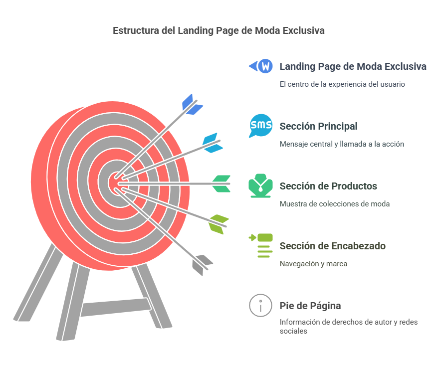

# Tienda de Ropa - Moda Exclusiva  

<p align="center">
  
</p>

## Descripción del Proyecto  
Este proyecto consiste en una **Landing Page para una tienda de ropa exclusiva**, diseñada para mostrar productos de moda y captar clientes mediante una experiencia de usuario limpia y eficiente.  

El objetivo es ofrecer un **diseño atractivo, responsive y optimizado**, utilizando **HTML5 y TailwindCSS** para una implementación rápida y flexible.  

## Estructura de la Página  
La Landing Page está dividida en las siguientes secciones:

### 1. Encabezado (Header)  
- Contiene el **logo** y la **navegación principal** con enlaces internos.  
- Diseño adaptable para pantallas grandes y móviles.  

### 2. Sección Principal (Main)  
- Presenta el **mensaje clave** de la tienda con un título llamativo y un formulario de suscripción.  
- Incluye un **Call to Action (CTA)** para atraer clientes.  

### 3. Catálogo de Productos (Products)  
- Muestra una **selección de productos destacados** con imágenes y descripciones.  
- Disposición en **grid** para mejorar la visualización.  

### 4. Pie de Página (Footer)  
- Contiene enlaces a **redes sociales** y la información de derechos de autor.  

---

## Tecnologías Utilizadas  
- **HTML5** – Estructura semántica accesible.  
- **TailwindCSS** – Diseño rápido con clases utilitarias.  
- **Git & GitHub** – Control de versiones y colaboración.  
- **Responsive Web Design** – Optimización para múltiples dispositivos.  

---

## Prototipo del Proyecto  
Este fue el prototipo inicial del diseño:  

<p align="center">
  
</p>

---

## Deployment (Enlace en Vivo)  
El proyecto está disponible en el siguiente enlace:  

🔗 [**Landing Page en GitHub Pages**](https://alexancelovici.github.io/landing-tienda-ropa/)
  
---

## Cómo Usarlo Localmente  
Para clonar y ejecutar este proyecto en tu computadora:  

1. **Clona el repositorio:**  
   ```sh
   git clone https://github.com/alexancelovici/landing-tienda-ropa.git
